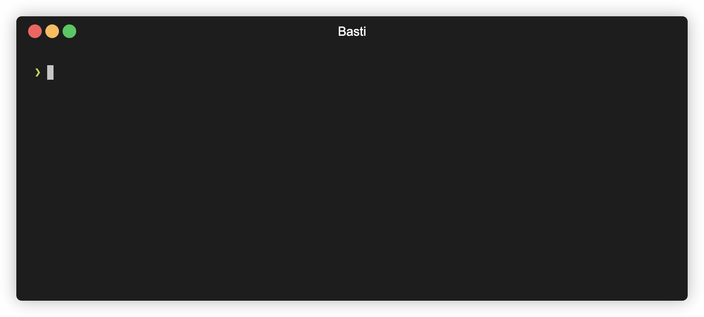

<h1 align="center">Basti</h1>

<div align="center">
  <a href="https://makeapullrequest.com/">
    
  </a>
  <a href="https://www.npmjs.com/package/basti">
    
  </a>
  <a href="./LICENSE">
    
  </a>
</div>

<br/>

<div align="center">
  Basti <em>(from <a href="https://en.wikipedia.org/wiki/Bastion_host"><strong>Basti</strong>on Host</a>)</em> is a CLI tool for accessing DB instances and other AWS resources in private networks almost at no cost.
</div>

<br/>

<div align="center">
  
</div>

## How it works

- Basti sets up a so called _bastion EC2 instance_ in the connection target's VPC.

- The bastion instance is used with AWS Session Manager port forwarding capability to make the target available on your _localhost_.

- Basti takes care of keeping the bastion instance stopped when it's not used to make the solution cost as low as **≈0.01 USD** per hour of connection plus **≈0.80 USD** per month of maintaining the instance in a stopped state.

- Security completely relies on AWS Session Manager and IAM policies. The bastion instance is not accessible from the Internet, and no SSH keys are used.

## Installation

```sh
npm install --global basti
```

Other, NodeJS-independent, installation options are coming soon!

## Basic usage

Basti uses AWS SDK and relies on credentials to be configured in your system. You can use any of [the methods](https://docs.aws.amazon.com/sdk-for-javascript/v3/developer-guide/setting-credentials-node.html) supported by AWS SDK to configure credentials.

> **Note**  
> You can expect Basti to work if you can use AWS CLI in your terminal.

### Initialize target

First, initialize your target for use with Basti. The following command will set up all the infrastructure required to start a connection. _You only need to do this once_.

```sh
basti init
```

You will be prompted for a target to initialize and a **public** VPC subnet to create the bastion EC2 instance in.

### Connect to target

Now, you can start the connection. This command will establish a secure port forwarding session and make the target available on your _localhost_.

```sh
basti connect
```

You will be prompted for the target to connect to as well as the local port to forward the connection to.

### Use target on _localhost_

Finally, you can use the target same way as it was running on your _localhost_ and port you specified in the previous step.

```sh
psql -h localhost -p 5432
```

> **Note**  
> _psql_, the PostgreSQL client, is used as an example here. Basti can be used to connect to any type of database or other service as long as the communication is done over TCP.

### Cleanup (optional)

You can remove all the resources created by Basti in you AWS account.

```sh
basti cleanup
```

The list of resources will be displayed and you will be prompted to confirm the cleanup.

## Custom connection target

Basti provides first class support for RDS instances and Aurora clusters. However, you can use Basti to connect to any other target in your AWS VPC (e.g. Elasticache instance, EC2 instance, etc.).

To connect to a custom target, select the `Custom` option when prompted for a target to initialize or connect to. You will be prompted for the target's VPC, IP address and port.

> **Note**  
> Feel free to open an issue or a pull request if you want to extend the list of natively supported targets 😉

## Using Basti in CI/CD pipelines

Using interactive mode is convenient when you're getting used to Basti. However, in Continuous Integration and Continuous Delivery (CI/CD) pipelines, you will probably want to disable interactivity and pass all the options as command line arguments.

Take for example the non-interactive form of the `basti connect` command:

```sh
basti connect --rds-instance your-instance-id --local-port your-port
```

Use the `basti <command> --help` to see all the available options for `basti connect` and other commands.
