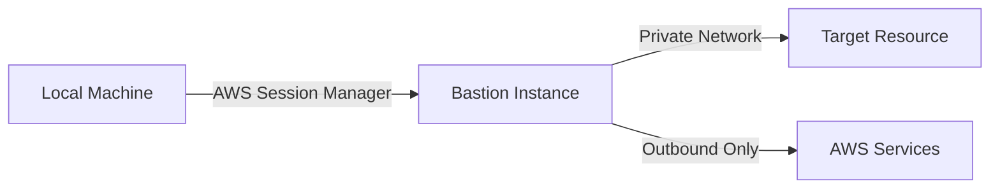

# Network Security

Basti is designed with security-first principles, ensuring your AWS resources remain protected while being accessible.

## Network Architecture

### Components

1. **Bastion Instance**
   - Deployed in a public subnet (by default)
   - No inbound internet access
   - Outbound access only for AWS Session Manager

2. **Target Resources**
   - Remain in private subnets
   - No changes to existing security

3. **AWS Session Manager**
   - Secure communication channel
   - No need for SSH ports
   - Fully auditable connections

## Network Flow



## Security Groups

### Bastion Instance

```hcl
# Example security group configuration
resource "aws_security_group" "basti_bastion" {
  name        = "basti-bastion"
  description = "Security group for Basti bastion instance"
  vpc_id      = var.vpc_id
  
  # No inbound rules needed
  
  egress {
    from_port   = 0
    to_port     = 0
    protocol    = "-1"
    cidr_blocks = ["0.0.0.0/0"]
  }
}
```

### Target Resource

```hcl
resource "aws_security_group_rule" "target_from_bastion" {
  type                     = "ingress"
  from_port               = var.target_port
  to_port                 = var.target_port
  protocol                = "tcp"
  source_security_group_id = aws_security_group.basti_bastion.id
  security_group_id       = var.target_security_group_id
}
```

## Network Access Control Lists (NACLs)

### Public Subnet (Bastion)

```hcl
resource "aws_network_acl" "public" {
  vpc_id = var.vpc_id
  
  egress {
    protocol   = "-1"
    rule_no    = 100
    action     = "allow"
    cidr_block = "0.0.0.0/0"
    from_port  = 0
    to_port    = 0
  }
  
  ingress {
    protocol   = "-1"
    rule_no    = 100
    action     = "allow"
    cidr_block = "0.0.0.0/0"
    from_port  = 0
    to_port    = 0
  }
}
```

### Private Subnet (Target)

```hcl
resource "aws_network_acl" "private" {
  vpc_id = var.vpc_id
  
  ingress {
    protocol   = "tcp"
    rule_no    = 100
    action     = "allow"
    cidr_block = var.vpc_cidr
    from_port  = var.target_port
    to_port    = var.target_port
  }
}
```

## VPC Endpoints

Required endpoints for Session Manager:

```hcl
resource "aws_vpc_endpoint" "ssm" {
  vpc_id            = var.vpc_id
  service_name      = "com.amazonaws.${var.region}.ssm"
  vpc_endpoint_type = "Interface"
  subnet_ids        = var.private_subnet_ids
  
  security_group_ids = [aws_security_group.vpce.id]
}

resource "aws_vpc_endpoint" "ssmmessages" {
  vpc_id            = var.vpc_id
  service_name      = "com.amazonaws.${var.region}.ssmmessages"
  vpc_endpoint_type = "Interface"
  subnet_ids        = var.private_subnet_ids
  
  security_group_ids = [aws_security_group.vpce.id]
}

resource "aws_vpc_endpoint" "ec2messages" {
  vpc_id            = var.vpc_id
  service_name      = "com.amazonaws.${var.region}.ec2messages"
  vpc_endpoint_type = "Interface"
  subnet_ids        = var.private_subnet_ids
  
  security_group_ids = [aws_security_group.vpce.id]
}
```

## Private Subnet Configuration

When using `--bastion-assign-public-ip false`:

1. **NAT Gateway**
   ```hcl
   resource "aws_nat_gateway" "main" {
     allocation_id = aws_eip.nat.id
     subnet_id     = var.public_subnet_id
   }
   ```

2. **Route Table**
   ```hcl
   resource "aws_route_table" "private" {
     vpc_id = var.vpc_id
     
     route {
       cidr_block     = "0.0.0.0/0"
       nat_gateway_id = aws_nat_gateway.main.id
     }
   }
   ```

## Best Practices

1. **Network Isolation**
   - Use private subnets for targets
   - Implement proper NACLs
   - Restrict security group rules

2. **Access Control**
   - Use IAM roles and policies
   - Implement proper logging
   - Regular security audits

3. **Monitoring**
   - Enable VPC Flow Logs
   - Monitor Session Manager
   - Set up alerts

## Next Steps

Learn about:
- [IAM Permissions](./iam-permissions)
- [Software Security](./software-security)
- [Team Usage](../team-usage/shared-configuration)
