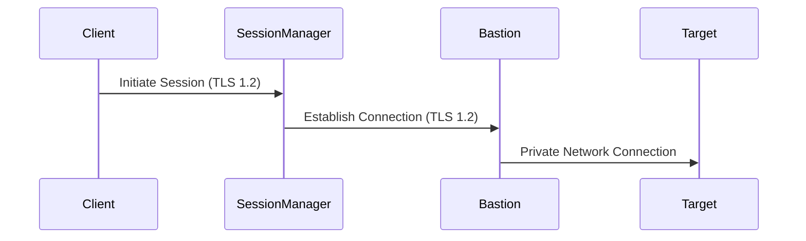

# Software Security

Basti implements multiple layers of software security to protect your infrastructure and data.

## Authentication

### AWS Credentials

Basti uses the AWS SDK's credential chain:

1. Environment variables
   ```bash
   export AWS_ACCESS_KEY_ID=your_access_key
   export AWS_SECRET_ACCESS_KEY=your_secret_key
   export AWS_SESSION_TOKEN=your_session_token
   ```

2. Shared credentials file
   ```ini
   # ~/.aws/credentials
   [default]
   aws_access_key_id = your_access_key
   aws_secret_access_key = your_secret_key
   ```

3. IAM roles
   ```json
   {
     "Version": "2012-10-17",
     "Statement": [
       {
         "Effect": "Allow",
         "Principal": {
           "Service": "ec2.amazonaws.com"
         },
         "Action": "sts:AssumeRole"
       }
     ]
   }
   ```

### Multi-Factor Authentication (MFA)

```bash
# Using MFA with AWS CLI
aws sts get-session-token \
  --serial-number arn:aws:iam::123456789012:mfa/user \
  --token-code 123456
```

## Session Management

### Session Encryption

All sessions are encrypted using AWS Session Manager's TLS 1.2 encryption:



### Session Monitoring

Enable CloudWatch logging:

```json
{
  "CloudWatchLogGroupName": "basti-sessions",
  "CloudWatchEncryptionEnabled": true,
  "CloudWatchStreamingEnabled": true
}
```

### Session Timeouts

Configure session timeouts:

```json
{
  "maxSessionDuration": 3600,
  "idleSessionTimeout": 1800
}
```

## Data Protection

### In-Transit Encryption

1. **Client to Bastion**
   - TLS 1.2 encryption via Session Manager
   - Perfect Forward Secrecy (PFS)
   - Strong cipher suites

2. **Bastion to Target**
   - Private VPC network
   - Optional application-level encryption

### Secrets Management

```typescript
// Using AWS Secrets Manager
import { SecretsManagerClient, GetSecretValueCommand } from "@aws-sdk/client-secrets-manager";

const getSecret = async (secretName: string) => {
  const client = new SecretsManagerClient();
  const command = new GetSecretValueCommand({
    SecretId: secretName,
  });
  
  const response = await client.send(command);
  return response.SecretString;
};
```

## Audit and Compliance

### CloudTrail Logging

Enable detailed logging:

```json
{
  "Version": "1.0",
  "Trail": {
    "Name": "basti-audit-trail",
    "IncludeGlobalServiceEvents": true,
    "IsMultiRegionTrail": true,
    "EnableLogFileValidation": true
  }
}
```

### Session Recording

Configure session logging:

```json
{
  "SessionManager": {
    "LoggingConfiguration": {
      "CloudWatchLogsLogGroupName": "basti-sessions",
      "S3BucketName": "basti-session-logs",
      "S3KeyPrefix": "session-logs/"
    }
  }
}
```

### Compliance Reports

Generate compliance reports:

```bash
# Example script
aws cloudtrail lookup-events \
  --lookup-attributes AttributeKey=EventName,AttributeValue=StartSession \
  --start-time 2023-01-01 \
  --end-time 2023-12-31 \
  > session-audit-report.json
```

## Best Practices

1. **Access Control**
   - Use MFA for all users
   - Implement least privilege
   - Regular access reviews

2. **Monitoring**
   - Enable CloudWatch logs
   - Set up alerts
   - Regular audit reviews

3. **Updates**
   - Keep Basti updated
   - Patch bastion instances
   - Review security advisories

4. **Documentation**
   - Security procedures
   - Incident response
   - Compliance requirements

## Security Checklist

- [ ] IAM roles configured with least privilege
- [ ] MFA enabled for all users
- [ ] Session Manager logging enabled
- [ ] CloudTrail audit logging configured
- [ ] Security groups properly restricted
- [ ] Regular security reviews scheduled
- [ ] Incident response plan documented
- [ ] Compliance requirements met

## Next Steps

Learn about:
- [Network Security](./network-security)
- [IAM Permissions](./iam-permissions)
- [Team Usage](../team-usage/shared-configuration)
