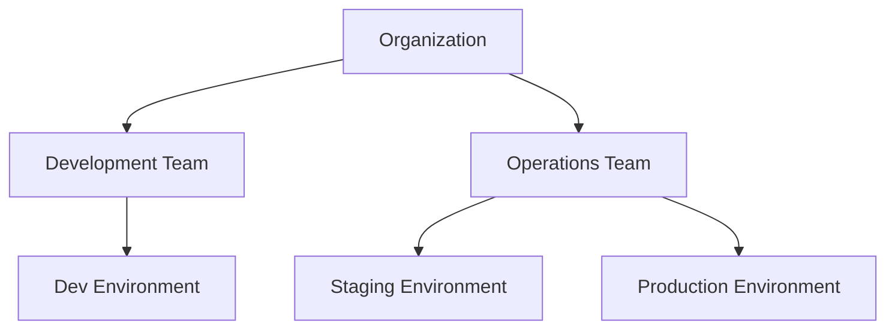

# Minimal IAM Permissions

Learn how to configure minimal IAM permissions for secure team usage of Basti.

## Basic User Policy

### Read-Only Access

```json
{
  "Version": "2012-10-17",
  "Statement": [
    {
      "Effect": "Allow",
      "Action": [
        "ec2:DescribeInstances",
        "ec2:DescribeSecurityGroups",
        "ec2:DescribeSubnets",
        "ec2:DescribeVpcs",
        "rds:DescribeDBInstances",
        "elasticache:DescribeCacheClusters"
      ],
      "Resource": "*"
    }
  ]
}
```

### Connection Access

```json
{
  "Version": "2012-10-17",
  "Statement": [
    {
      "Effect": "Allow",
      "Action": [
        "ssm:StartSession",
        "ssm:TerminateSession",
        "ssm:ResumeSession"
      ],
      "Resource": [
        "arn:aws:ec2:*:*:instance/*",
        "arn:aws:ssm:*:*:session/*"
      ],
      "Condition": {
        "StringLike": {
          "ssm:resourceTag/ManagedBy": "basti"
        }
      }
    }
  ]
}
```

## Role-Based Access

### Developer Role

```json
{
  "Version": "2012-10-17",
  "Statement": [
    {
      "Effect": "Allow",
      "Action": [
        "ec2:RunInstances",
        "ec2:TerminateInstances",
        "ec2:StartInstances",
        "ec2:StopInstances"
      ],
      "Resource": "*",
      "Condition": {
        "StringEquals": {
          "aws:RequestTag/Environment": "development"
        }
      }
    }
  ]
}
```

### Operations Role

```json
{
  "Version": "2012-10-17",
  "Statement": [
    {
      "Effect": "Allow",
      "Action": [
        "ec2:RunInstances",
        "ec2:TerminateInstances",
        "ec2:StartInstances",
        "ec2:StopInstances",
        "iam:PassRole",
        "iam:CreateRole",
        "iam:DeleteRole",
        "iam:PutRolePolicy",
        "iam:DeleteRolePolicy"
      ],
      "Resource": "*",
      "Condition": {
        "StringEquals": {
          "aws:RequestTag/Environment": [
            "staging",
            "production"
          ]
        }
      }
    }
  ]
}
```

## Environment Separation

### Development Environment

```json
{
  "Version": "2012-10-17",
  "Statement": [
    {
      "Effect": "Allow",
      "Action": [
        "ec2:*",
        "rds:*",
        "elasticache:*"
      ],
      "Resource": "*",
      "Condition": {
        "StringEquals": {
          "aws:RequestTag/Environment": "development"
        }
      }
    }
  ]
}
```

### Production Environment

```json
{
  "Version": "2012-10-17",
  "Statement": [
    {
      "Effect": "Allow",
      "Action": [
        "ec2:DescribeInstances",
        "ssm:StartSession"
      ],
      "Resource": "*",
      "Condition": {
        "StringEquals": {
          "aws:RequestTag/Environment": "production"
        }
      }
    }
  ]
}
```

## Cross-Account Access

### Trust Relationship

```json
{
  "Version": "2012-10-17",
  "Statement": [
    {
      "Effect": "Allow",
      "Principal": {
        "AWS": "arn:aws:iam::SOURCE_ACCOUNT_ID:root"
      },
      "Action": "sts:AssumeRole",
      "Condition": {
        "StringEquals": {
          "aws:PrincipalOrgID": "o-example123"
        }
      }
    }
  ]
}
```

### Cross-Account Role

```json
{
  "Version": "2012-10-17",
  "Statement": [
    {
      "Effect": "Allow",
      "Action": [
        "ssm:StartSession",
        "ec2:DescribeInstances"
      ],
      "Resource": "*",
      "Condition": {
        "StringEquals": {
          "aws:ResourceTag/ManagedBy": "basti"
        }
      }
    }
  ]
}
```

## Permission Boundaries

### Developer Boundary

```json
{
  "Version": "2012-10-17",
  "Statement": [
    {
      "Effect": "Allow",
      "Action": [
        "ec2:*",
        "rds:*",
        "elasticache:*",
        "ssm:*"
      ],
      "Resource": "*",
      "Condition": {
        "StringEquals": {
          "aws:RequestTag/Environment": [
            "development",
            "staging"
          ]
        }
      }
    }
  ]
}
```

## Service Control Policies (SCPs)

### Resource Protection

```json
{
  "Version": "2012-10-17",
  "Statement": [
    {
      "Effect": "Deny",
      "Action": [
        "ec2:DeleteSecurityGroup",
        "ec2:RevokeSecurityGroupIngress"
      ],
      "Resource": "*",
      "Condition": {
        "StringEquals": {
          "aws:ResourceTag/ManagedBy": "basti"
        }
      }
    }
  ]
}
```

## Best Practices

1. **Least Privilege**
   - Start with minimal permissions
   - Add permissions as needed
   - Regular access reviews

2. **Resource Tagging**
   - Enforce resource tags
   - Use tags for access control
   - Consistent naming

3. **Access Control**
   - Environment separation
   - Role-based access
   - Permission boundaries

4. **Monitoring**
   - Enable CloudTrail
   - Regular audits
   - Access alerts

## Example Implementation

### Team Structure



### Policy Structure

```
policies/
├── roles/
│   ├── developer.json
│   ├── operator.json
│   └── admin.json
├── boundaries/
│   ├── development.json
│   └── production.json
└── scps/
    ├── resource-protection.json
    └── compliance.json
```

## Next Steps

Learn about:
- [Usage Audit](./usage-audit)
- [Shared Configuration](./shared-configuration)
- [Security](../security/iam-permissions)
